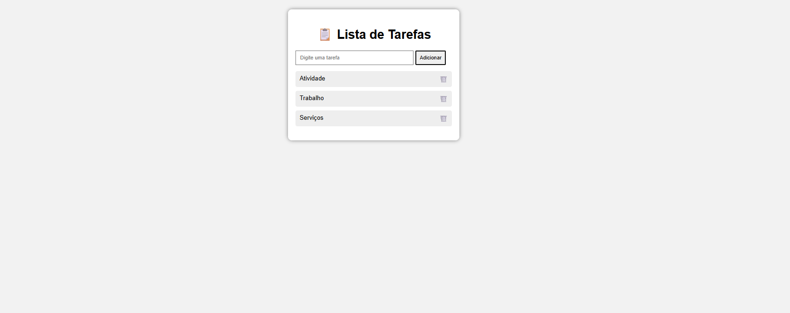

# Lista-de-Tarefas

Uma aplicação simples desenvolvida com HTML, CSS e JavaScript para organizar tarefas do dia a dia.

O projeto permite adicionar e remover tarefas por meio de uma interface simples e intuitiva. Foi desenvolvido para praticar os conceitos básicos de desenvolvimento web.

✨ Funcionalidades
➕ Adicionar tarefas
🗑️ Remover tarefas
📱 Interface simples e responsiva
🛠️ Tecnologias Utilizadas
HTML5
CSS3
JavaScript
📂 Estrutura do Projeto
lista-de-tarefas/
│
├── index.html
├── style.css
├── script.js
└── README.md
▶️ Como Executar
Faça o download ou clone este repositório.
Abra a pasta do projeto.
Dê um duplo clique no arquivo index.html ou abra-o em um navegador.

Não é necessário instalar nenhuma dependência.

🎯 Objetivo

Este projeto foi desenvolvido para praticar os fundamentos do desenvolvimento web, utilizando HTML para estruturar a página, CSS para estilização e JavaScript para adicionar interatividade.

🚀 Melhorias Futuras
Editar tarefas
Marcar tarefas como concluídas
Salvar tarefas no navegador com Local Storage
Adicionar filtros de pesquisa

👩‍💻 Autora

Anna Luiza Pereira Silva
Estudante de Engenharia de Software – PUC Minas

GitHub:https://github.com/annaluizapsilva-03

